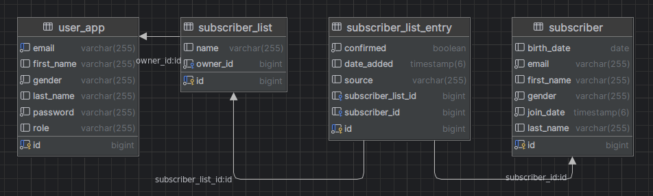
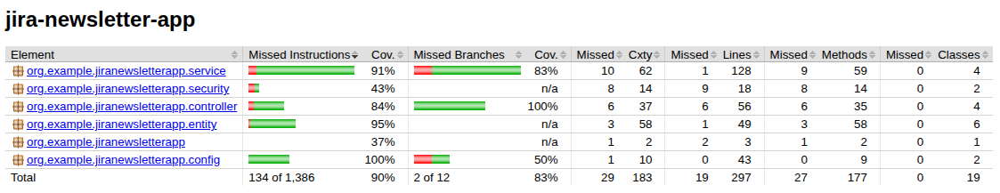

# Newsletter App
A Spring Boot REST API for managing newsletter subscribers and subscriber lists, secured with role-based access control.

## Table of Contents

1. [Project Overview](#project-overview)
2. [Technologies](#technologies)
3. [Architecture & Project Structure](#architecture--project-structure)
4. [Database structure](#database-structure)
5. [Prerequisites](#prerequisites)
6. [Installation & Running](#installation--running)
7. [Configuration](#configuration)
8. [Database Migrations (Flyway)](#database-migrations-flyway)
9. [Data Seeding](#data-seeding)
10. [API Endpoints](#api-endpoints)
11. [Security](#security)
12. [Testing](#testing)

## Project Overview
This application provides a RESTful API to:
- Manage user accounts (ADMIN role)
- Create, read, update, and delete subscribers
- Create and manage subscriber lists
- Assign subscribers to lists
- Enforce access restrictions based on USER and ADMIN roles

## Technologies
- Java 21
- Spring Boot 3.4.5
- Spring Data JPA (Hibernate)
- Flyway 10.22.0
- PostgreSQL 15
- Docker & Docker Compose
- Spring Security
- SpringDoc OpenAPI / Swagger UI
- Lombok
- JUnit 5, Mockito

## Architecture & Project Structure
```
jira-newsletter-app
├── .github/                   # CI/CD workflows (optional)
├── src/
│   ├── main/
│   │   ├── java/org/example/jiranewsletterapp
│   │   │   ├── JiraNewsletterAppApplication.java     # Main application
│   │   │   ├── config/                               # Additional configuration
│   │   │   ├── init/                                 # DataSeeder for initial data
│   │   │   ├── entity/                               # JPA entities & enums
│   │   │   │   ├── User.java
│   │   │   │   ├── Subscriber.java
│   │   │   │   ├── SubscriberList.java
│   │   │   │   ├── SubscriberListEntry.java
│   │   │   │   ├── Role.java
│   │   │   │   └── Gender.java
│   │   │   ├── repository/                           # Spring Data JPA repositories
│   │   │   │   ├── UserRepository.java
│   │   │   │   ├── SubscriberRepository.java
│   │   │   │   ├── SubscriberListRepository.java
│   │   │   │   └── SubscriberListEntryRepository.java
│   │   │   ├── service/                              # Business logic services
│   │   │   │   ├── UserService.java
│   │   │   │   ├── SubscriberService.java
│   │   │   │   ├── SubscriberListService.java
│   │   │   │   └── SubscriberListEntryService.java
│   │   │   ├── security/                             # Spring Security classes
│   │   │   │   ├── SecurityConfig.java
│   │   │   │   ├── CustomUserDetailsService.java
│   │   │   │   └── UserPrincipal.java
│   │   │   └── controller/                           # REST controllers
│   │   │       ├── UserController.java
│   │   │       ├── SubscriberController.java
│   │   │       ├── SubscriberListController.java
│   │   │       └── SubscriberListEntryController.java
│   │   └── resources/
│   │       ├── application.properties                # Main configuration
│   │       └── db/migration/                         # Flyway SQL migrations
│   │           ├── V1__create_subscriber_table.sql
│   │           ├── V2__create_user_app_table.sql
│   │           ├── V3__create_subscriber_list_table.sql
│   │           └── V4__create_subscribe_list_entry_table.sql
│   └── test/
│       ├── java/org/example/jiranewsletterapp
│       │   ├── integration/                          # Integration tests for controllers
│       │   │   ├── UserControllerIntegrationTest.java
│       │   │   ├── SubscriberControllerIntegrationTest.java
│       │   │   ├── SubscriberListControllerIntegrationTest.java
│       │   │   └── SubscriberListEntryControllerIntegrationTest.java
│       │   ├── service/                              # Unit tests for services
│       │   │   ├── UserServiceTest.java
│       │   │   ├── SubscriberServiceTest.java
│       │   │   ├── SubscriberListServiceTest.java
│       │   │   └── SubscriberListEntryServiceTest.java
│       │   └── JiraNewsletterAppApplicationTests.java
│       └── resources/
│           └── application-test.properties           # Test-specific configuration
├── Dockerfile
├── docker-compose.yml
├── pom.xml
└── README.md
```

## Database structure
### ERD diagram


### Database relations

### Tables
#### user_app
Stores application users with fields:
  - id (PK)
  - email
  - first_name
  - last_name
  - password
  - gender
  - role
#### subscriber
Represents newsletter subscribers, containing:
  - id (PK)
  - email
  - first_name
  - last_name
  - birth_date
  - gender
#### subscriber_list
Defines named lists of subscribers. One user (owner) can have multiple subscriber lists (1‑to‑many). Each record has:
- id
- name
- owner_id referencing user_app.id
  
#### subscriber_list_entry
Join table linking subscriber and subscriber_list. A subscriber can appear on multiple lists, and each list can include multiple subscribers (many‑to‑many with extra columns). Contains:
- id
- subscriber_id
- subscriber_list_id
- metadata fields:
  -  confirmed
  -  date_added
  -  source

## Prerequisites
- Java JDK 21+
- Maven 3.8+
- Docker & Docker Compose

## Installation & Running
1. Clone the repository:
```
git clone <repository-url>
cd jira-newsletter-app
```
2. Build the project:
```
mvn clean package -DskipTests
```
3. Start services with Docker Compose:
```
docker compose up --build
```
- Application: http://localhost:8080
- PostgreSQL: localhost:5432

## Configuration
- application.properties
```
spring.application.name=jira-newsletter-app
spring.datasource.url=jdbc:postgresql://db:5432/newsletter_app
spring.datasource.username=admin
spring.datasource.password=password
spring.jpa.hibernate.ddl-auto=update
spring.jpa.show-sql=true
spring.flyway.enabled=true
spring.flyway.database-type=postgresql
spring.flyway.locations=classpath:db/migration
spring.flyway.postgresql.accept-unknown-version=true
```

- docker-compose.yml
```
services:
  app:
    build:
      context: .
    container_name: jira-newsletter-app
    ports:
      - "8080:8080"
    environment:
      - SPRING_DATASOURCE_URL=jdbc:postgresql://db:5432/newsletter_app
      - SPRING_DATASOURCE_USERNAME=admin
      - SPRING_DATASOURCE_PASSWORD=password
      - SPRING_JPA_HIBERNATE_DDL_AUTO=update
    depends_on:
      - db

  db:
    image: postgres:15
    container_name: newsletter-db
    ports:
      - "5432:5432"
    environment:
      POSTGRES_DB: newsletter_app
      POSTGRES_USER: admin
      POSTGRES_PASSWORD: password
    volumes:
      - postgres_data:/var/lib/postgresql/data

volumes:
  postgres_data:
```

## Database Migrations (Flyway)
All SQL migration scripts are in src/main/resources/db/migration:
1. V1__create_subscriber_table.sql
2. V2__create_user_app_table.sql
3. V3__create_subscriber_list_table.sql
4. V4__create_subscribe_list_entry_table.sql
Each script contains only the necessary DDL statements for its version.

## Data Seeding
A DataSeeder class runs at startup to insert an initial admin user:
- Email: admin1@example.com
- Password: secret123
- Role: ADMIN

## API Endpoints
### Authentication (all roles)
- POST /login – authenticate user and start session
- POST /logout – invalidate session

### Admin API
#### Users – Admin API
- GET /users                  – list all users
- GET /users/{id}             – get user by ID
- POST /users                 – create a new user
- PUT /users/{id}             – update user by ID
- DELETE /users/{id}          – delete user by ID

#### Subscribers – Admin API
- GET /subscribers            – list all subscribers
- GET /subscribers/{id}       – get subscriber by ID
- POST /subscribers           – create a new subscriber
- PUT /subscribers/{id}       – update subscriber by ID
- DELETE /subscribers/{id}    – delete subscriber by ID
- DELETE /subscribers/email/{email} – delete subscriber by email

#### Subscriber Lists – Admin API
- GET /subscriber-lists – list all subscriber lists
- GET /subscriber-lists/{id} – get list by ID
- POST /subscriber-lists – create a subscriber list for any user
- PUT /subscriber-lists/{id} – update list by ID
- DELETE /subscriber-lists/{id} – delete list by ID

#### Subscriber List Entries – Admin API
- GET /subscriber-entries – list all entries
- GET /subscriber-entries/{id} – get entry by ID
- POST /subscriber-entries – create entry for any list
- PUT /subscriber-entries/{id} – update entry by ID
- DELETE /subscriber-entries/{id} – delete entry by ID
- POST /subscriber-entries/assign?listId=&subscriberId= – assign subscriber to list

### User API
#### Subscriber Lists – User API
- GET /subscriber-lists/my – list your subscriber lists
- GET /subscriber-lists/my/{id} – get your list by ID
- POST /subscriber-lists/my – create a list for yourself
- PUT /subscriber-lists/my/{id} – update your list by ID
- DELETE /subscriber-lists/my/{id} – delete your list by ID

Subscriber List Entries – User API
- GET /subscriber-entries/my – list entries on your lists
- POST /subscriber-entries/my/assign?listId=&subscriberId= – assign subscriber to your list
- DELETE /subscriber-entries/my/{id} – delete entry from your list by ID

Subscribers – User API
- GET /subscribers/my – list your subscribers

## Security
- Form-based login configured in SecurityConfig.java.
- CustomUserDetailsService and UserPrincipal for authentication.
- Roles: USER, ADMIN

## Testing
- Integration Tests in src/test/java/.../integration (controller tests).
- Unit Tests in src/test/java/.../service (service layer tests).
- Test configuration in application-test.properties.
### Code Coverage

